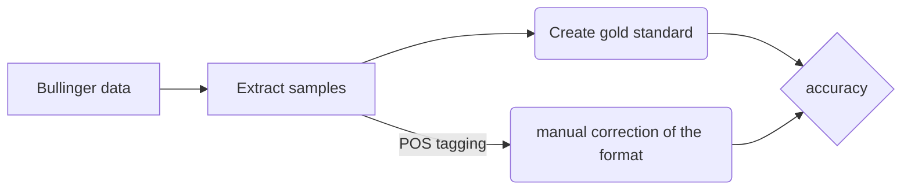
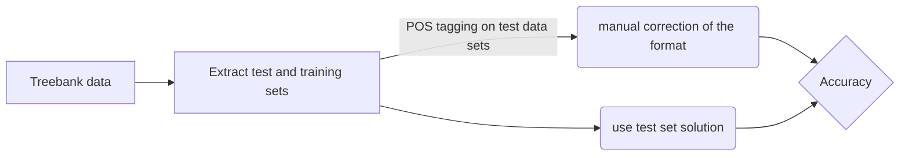
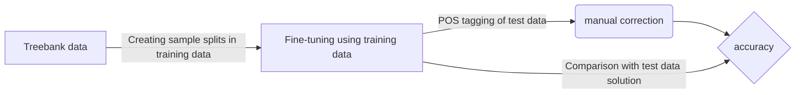

# The Structure of this Repository


This is the repository for my bachelor thesis. It contains all the code for extracting the samples from the Bullinger correspondence, the files to perform the POS tagging and the files used for the analysis. 

The process of analyzing the accuracy of the Bullinger test data was as follows: 



The data from the five Latin treebanks was used for a reference analysis.
The process is visualized here:


And the process of fine-tuning the GPT models can be summarized as shown below. I also used the test and training sets from the treebank for this. 



## Folder Structure

- **full_text_xml** 
This folder contains two files. One contains all the Latin parts of the editions and the other all the Latin parts of the transcribed Bullinger letters. They were collected with the help of the file **extract_text.py**, which is located in the parent directory. This script accesses a folder with all Bullinger data that I was allowed to use from the GitHub repository of the [Bullinger Digital Project](https://github.com/bullinger-digital/bullinger-korpus).  This data is not included in this repository as it is not my data. 

- **samples**
This folder contains the Bullinger sample data in xml format as well as a script for converting xml to txt. These examples were extracted from the parent directory using the **sample_editions.py** and **sample_transcriptions.py** scripts. The txt files of the data are also located in this folder. The **tokenizer.ipynb** script was used to tokenize the samples and save them in a txt file. 

- **Goldstandard**
This folder contains different versions of the gold standard (annotated by different people) and a script **compare_gs.ipynb** that compares the gold standard versions using IAA and compares the files tagged by the different taggers with the gold standard I created. This was done using accuracy. The confusion matrices are also created in this script. 

- **random-training-data-other-taggers**
This folder is intended for the tree database data. The **all_training_data.ipynb** script was used to create the different training splits for fine-tuning. The **compare_tagger_test.ipynb** script was used to compare the files tagged by the trained taggers with the reference test sets. This folder also contains all tagged versions of the test sets and the training splits for fine-tuning. 

-  **cltk** and **cltk_env**
These folders contain the code that is used to perform POS tagging with CLTK. I have used the virtual environment to be able to use Python version 3.9.7. To activate the virtual environment, navigate to the parent directory and then enter the following command in your command line: 
```python source cltk_env/bin/activate``` and to deactivate it again, enter ```deactivate```. 

- **latincy**
The script in **latincy_different_test_sets.ipynb** was used to apply the LatinCy POS tagger to the test data, and the script **latincy_tokenized.ipynb** was used to apply POS tagging to the Bullinger samples in their tokenized version. 

- **RDRPOSTagger**
The R script **RDRPOSTagger_tokenized.R** was used to apply the RDRPOSTagger to the Bullinger data using the language model **Latin-ITTB**. The script **RDRPOSTagger_different_test_sets.R** was used to tag the test sets of the treebanks. 

- **RDRPOSTagger-master**
There is also the RDRPOSTagger-master folder. This contains files that are required for the use of RDRPOSTagger. I have not added anything there.  

- **RNNTagger**
This folder contains the parameter files for Latin. For tagging a file, for example the file tokenized.txt,  go to the RNNTagger directory and enter the following command in the command line tool: ```cmd/rnn-tagger-latin.sh ../samples/tokenized.txt > Tagger_tokenized.txt```. 

- **TreeTagger**
    This folder contains the parameter files as well as a script **TreeTagger_to_upos.ipynb** to convert the output of the TreeTagger to UPOS format. To apply the TreeTagger to data, you must first be in the parent directory and then enter the following command in the command line tool to tag the file tokenized.txt: 
    ```cat samples/tokenized.txt | TreeTagger/cmd/tree-tagger-latin> TreeTagger/TreeTagger_tokenized.txt```

- **UDPipe**
This folder contains a script called **UDpipe_tokenized.R** which was used to tag the Bullinger data. The script **UDpipe_different_test_sets.R** was used to apply POS tagging to the treebank data. The parameter file **latin-proiel-ud-2.5-191206.udpipe** was used for both. 

- **GPT**
This folder contains the **gpt-api. py** file to apply POS tagging to the Bullinger data using the GPT API, the **Fine-TunedGPT3.5Turbo.ipynb** script used to fine-tune the models, and the **test_set_models.py** script used to tag the treebank data.

## Usage of scripts
| File | Stored in | Content |
|------|-----------|---------|
| all_training_data.ipynb | random-training-data-other-taggers | used to caluclate different metrics over the treebank files for different taggers |
| cltk_different_test_sets.ipynb | cltk | used to apply POS tagging with the CLTK tagger on the treebank test data |
| cltk_tokenized.ipynb | cltk | used to apply POS tagging with the CLTK tagger on the bullinger data |
| compare_gs.ipynb | Goldstandard | used to compare the gold standard of Bullinger data to the tagged files |
| compare_tagger_test.ipynb | random-training-data-other-taggers | used to compare the output of the taggers to the actual tags |
| extract_text.py | root directory | used to extract the latin sentences from the bullinger corpus |
| Fine-TunedGPT3.5Turbo.ipynb | GPT | used to fine-tune the gpt models |
| gpt-api .py | GPT | used to tag the bullinger data with gpt-3.5-turbo and gpt-4|
| gpt_sent.py | GPT | used to tag the bullinger data with the sentence approach with the fine-tuned GPT models|
|gpt_tagger_token.py | GPT | used for the token only approach on gpt| 
|test_set_models.py |GPT | used to apply the 'sentence' approach (bag of tokens) on the treebank test data. i used this for the fine-tuned models as well as gpt-3.5-tubro and gpt-4| 
| latincy_different_test_sets.ipynb | latincy | used to apply the LatinCy tagger using the large latin model to the treebank test sets |
| latincy_tokenized.ipynb | latincy | used to apply LatinCy POS tagger on the Bullinger data using the large latin model |
| RDRPOSTagger_different_test_sets.R | RDRPOSTagger | used to apply POS tagging using the RDRPOSTagger on the treebank data |
| RDRPOSTagger_tokenized.R | RDRPOSTagger | used to apply POS tagging using the RDRPOSTagger on the Bullinger data |
| sample_editions.py | root directory | used to perform stratified sampling and samples in total 100 sentences from different editions, authors and years from the editions/hbbw directory of the Bullinger data|
| sample_transcriptions.py | root directory | used to perform stratified sampling and samples in total 100 sentences from different authors and years from the non_edited/transcribed directory of the Bullinger data|
|tag_dist_tb.ipynb |random-training-data-other-taggers| used to plot the tag distribution on the treebank data |
| tokenizer.ipynb | samples | used to tokenize the Bullinger samples |
| TreeTagger_to_upos.ipynb | TreeTagger | used to transform treetagger tags to upos tags |
| UDpipe_different_test_sets.R | UDPipe | used to apply POS tagging using UDPipe on the treebank data |
| UDpipe_tokenized.R | UDPipe | used to apply POS tagging using UDPipe on the Bullinger data |
| xml_to_txt.py | samples | used to transform the xml content of the editions and transcriptions into txt format |


## Results

Below are the results of my experiments. For the Bullinger data, there are two results for the GPT models. This is due to the different prompting strategies. The first number refers to the token-only approach, while the second number refers to the approach with a sentence and token list. 

| Tagger | Bullinger | ITTB | LLCT | UDante | Preuel | PROIEL | 
|----------|----------|----------|----------|----------|----------|----------|
| LatinCy    | **79.8**     | 87.93     | 92.01     | 80.94     | 72.38     | 82.84     |
| CLTK    | 77.1     | 88.45     | 79.32     | 77.36     | 72.44     | 80.63     |
| UDPipe    | 72.8     | 71.59     | 71.45     | 70.51     | 69.2     | 84.49     |
| RDRPOSTagger    | 64.5     | 82.67     | 67.41     | 71.72     | 64.79     | 75.22     |
| TreeTagger    | 74.3     | 70.18     | 70.25     | 69.86     | 82.51     | 89.39     |
| GPT-3.5-Turbo    | 62.2/80.2     | 74.82     | 78.82     | 74.33     | 68.81     | 79.22     | 
| GPT-4    | 74.3/83.5     | 79.73    | 84.89     | 77.62     | 73.9     | 84.38   | 
| train50    | 70.3/84.8     | 89.59     | 89.2     | 83.55| 73.2     | 79.37    | 
| train100    | 69.4/**85.5**    | 89.73     | 91.03     | 85.26     | 74.19     | 82.19     |
| train200   | 68.2/80.0     | 91.57     | 90.93     | **85.8**     | 73.46     | 83.5   | 
| train500   | 58.8/77.2     | 93.2     | 93.85     | 82.71     | 72.09     | 86.72     | 
| train1000   | 65.8/82.5     | **94.88**     | **94.5**     | 84.94     | 81.39     | 89.25     | 
| train2000   | **78.2**/78.3     | 87.95     | 87.43     | 81.31     | **84.31**     | 87.83     | 
| train5000   | 71.9/76.6     | 88.11     | 84.85     | 74.62     | 81.99     | **90.0**     | 
| train10000   | 74.4/76.4     | 83.84     | 85.39     | 75.36| 76.34     | 86.01     |

